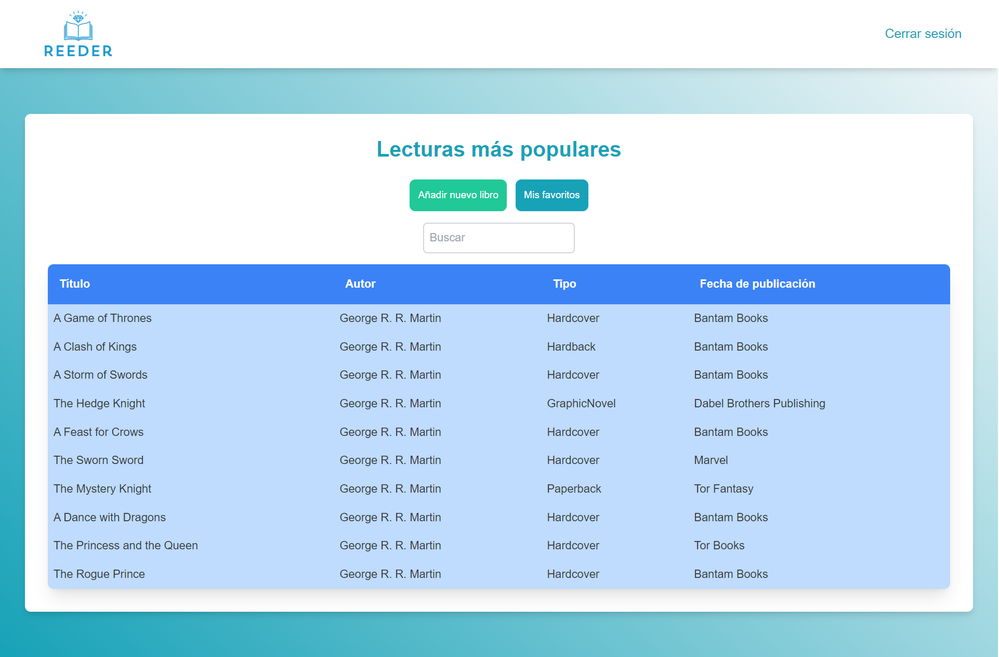
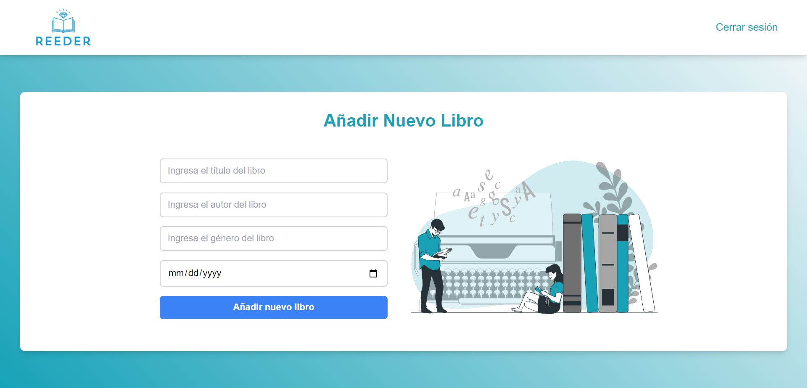
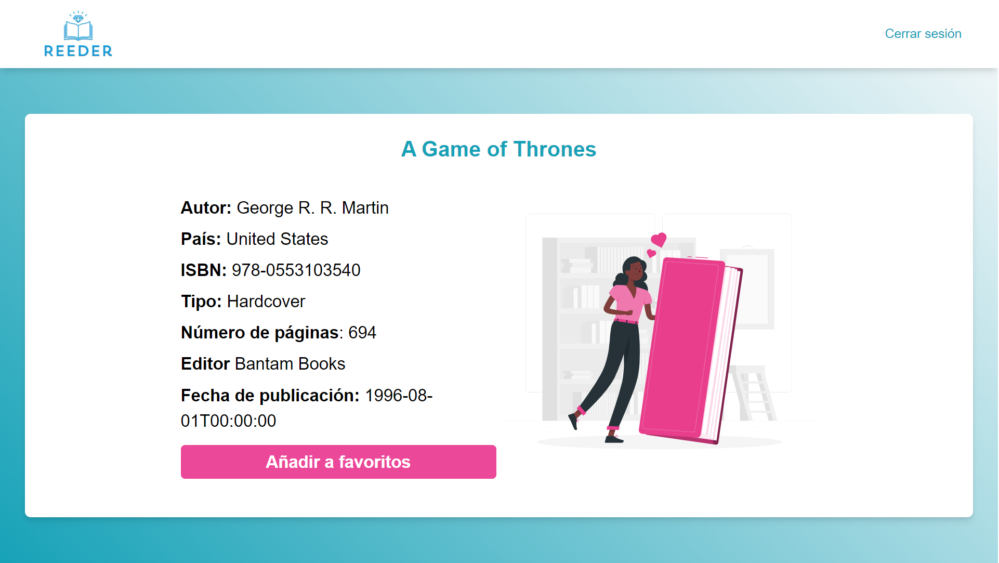
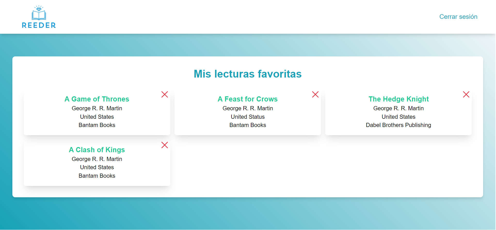
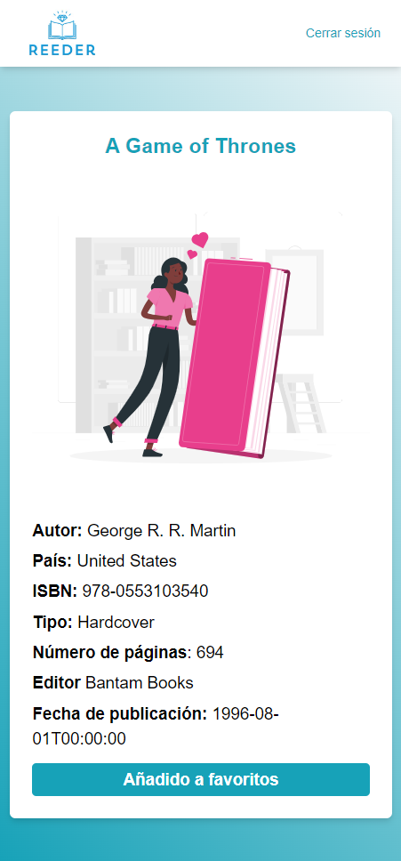
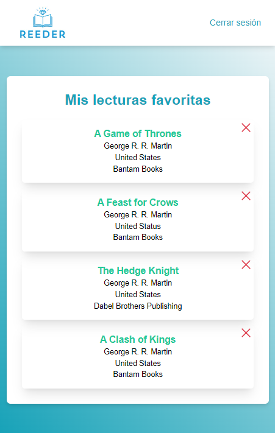

<p align="center">
    <a href="#linkdemo">
        
    </a>
</p>

<h1 id="web">Reeder Book App</h1>

A book reading app to enjoy your favorite stories anytime, anywhere. Immerse yourself in literature!

## Index

- [Getting started](#scripts)
- [Preview](#preview)
  - [Desktop](#desktop)
  - [Mobile](#mobile)
- [Technologies](#technologies)

<h2 id="scripts">🔥 Getting started</h2>

### Installation

```
git clone git@github.com:Hernan1ro/Reeder-book-app.git
```

```
npm install
```

```
npm run dev
```

## Configuring Environment Variables

The project uses environment variables for the configuration of certain aspects. Follow the steps below to configure the necessary environment variables:

1. Create a .env file at the root of the project.

2. Open the .env file and define the required environment variables in the following format: VITE_API_BOOKS=value. For example:

```
VITE_API_BOOKS="https://anapioficeandfire.com/api/"
```

3. Save the .env file.

<br>
<br>

<h2 id="preview">🔍 Preview</h2>

<details>
  <summary id="desktop">💻 Desktop version</summary>    
  
  
  
  
</details>

<details>
  <summary id="mobile">📱 Mobile version</summary>  
  
  
  
  
</details>
<br>
<br>
<h2 id="technologies">📲 Technologies</h2>

1. React
2. Tailwind
3. Vite.js
4. Typescript
5. React-router-dom
